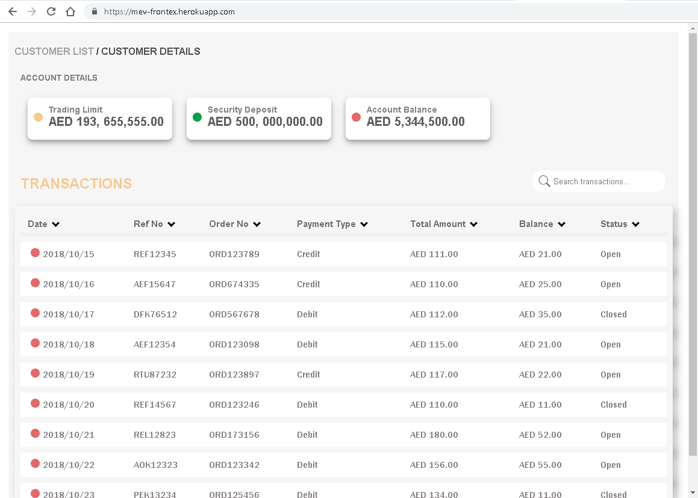
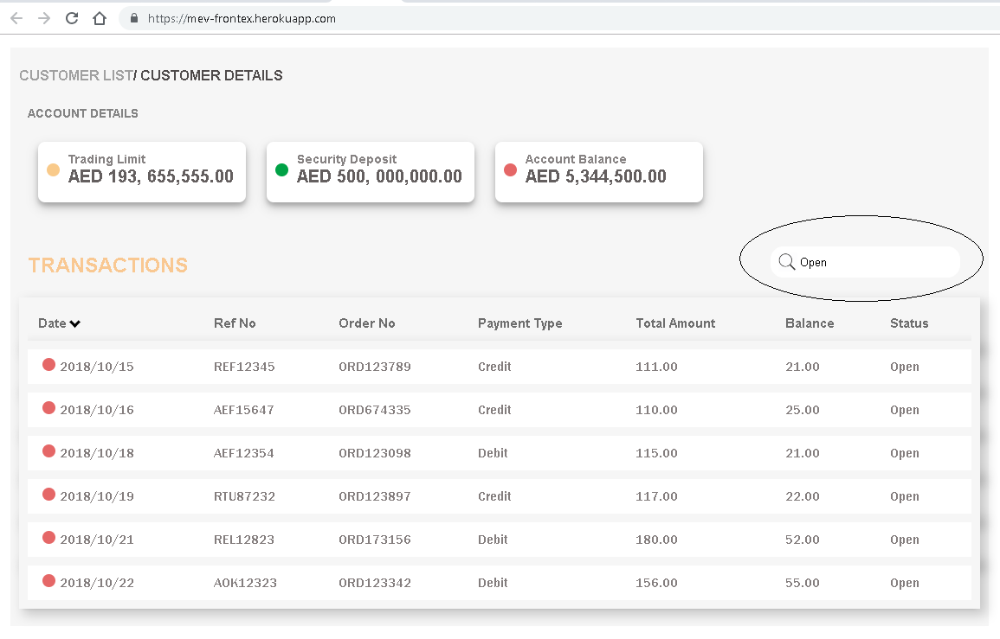
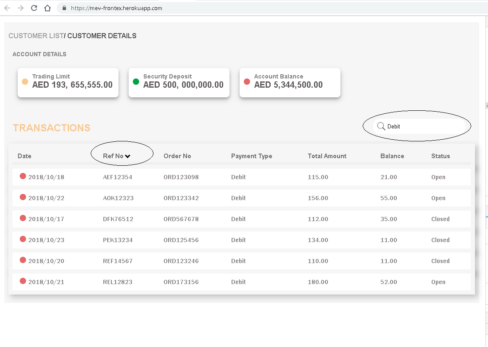

## Introduction
Sample Phoenix Framework implementation using React, Redux and PostgreSQL
 
## How to start the server
To start your Phoenix server:
  * Install dependencies with `mix deps.get`
  * Install Node.js dependencies with `cd assets && npm install`
  * Migrate Repo using `mix ecto.reset`
  * Start Phoenix endpoint with `mix phx.server`

Now you can visit [`localhost:4000`](http://localhost:4000) from your browser.

## Demo
Please visit [https://mev-frontex.herokuapp.com/](https://mev-frontex.herokuapp.com/)

Screenshots

  * Main dashboard
  
    
  * Search for transaction - type more than 2 letters in search box to trigger search
  
    
  * Search and sort together- type more than 2 letters in search box to trigger search
  
        

## Technologies Used
  * Phoenix/Elixir/Erlang
  * Ecto for Phoenix
  * React + Redux + Axios
  * Webpack
  * HTML5/CSS3
  * Postgres for Repo
  * Heroku Cloud
  * Visual Studio Code IDE

## Learn more
  * Official website: http://www.phoenixframework.org/
  * Guides: https://hexdocs.pm/phoenix/overview.html
  * Docs: https://hexdocs.pm/phoenix
  * Mailing list: http://groups.google.com/group/phoenix-talk
  * Source: https://github.com/phoenixframework/phoenix
  * React: https://reactjs.org
  * React + Redux: https://redux.js.org/basics/usage-with-react

 